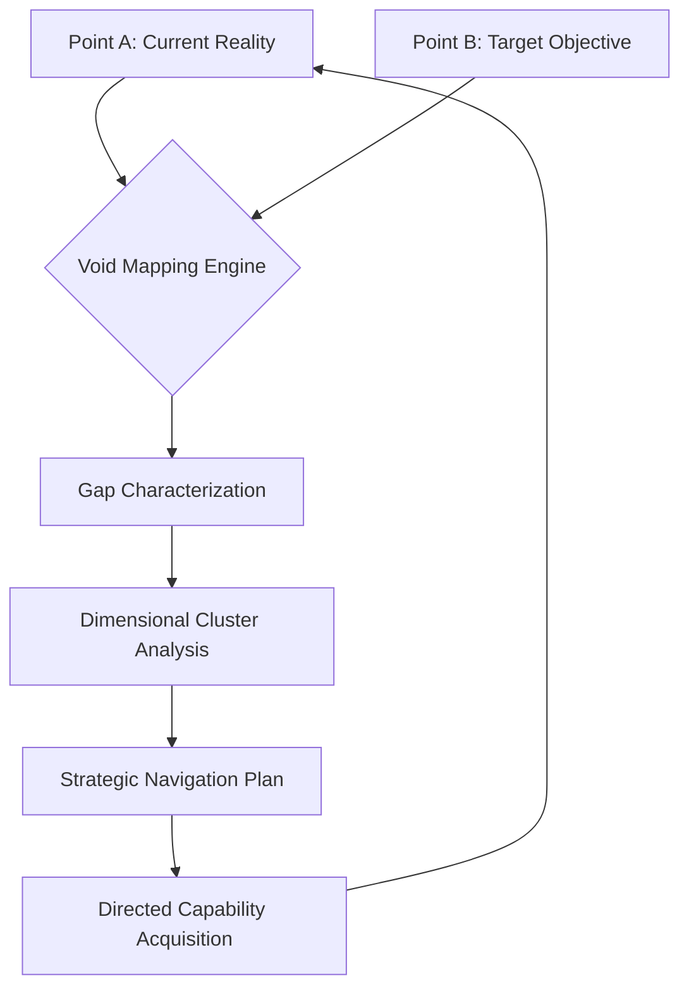

# Negative Space Framework


**An epistemology of absence for AI reasoning.** The Negative Space Framework shifts AI focus from interpolation to "Void Mapping"—identifying and classifying gaps (informational, causal, dependency) between current states and desired goals.

> Traditional engineering focuses on assembly. **Negative Space Reasoning** maps what's *missing*—transforming systemic uncertainty into precisely mapped territory for agentic navigation.

<a href="manifesto/MANIFESTO.md">Read the full manifesto →</a>

## 🧭 The Logic Flow (The Void Engine)


**Figure 1:** The Void Engine identifies dependency gaps, information voids, and constraint barriers through contrastive analysis rather than interpolation.

## 🚀 Installation

### From Source
```bash
# Clone the repository
git clone https://github.com/WADELABS/negative-space.git
cd negative-space

# Install in development mode
pip install -e .
```

### From PyPI (Coming Soon)
```bash
pip install negative-space
```

## 🛰️ The "Now": Mapping Architectural Voids
The following snippet demonstrates use of the `VoidAgent` to perform a rigorous assessment of the gap between a local environment and a production-ready Kubernetes deployment.

**Note:** The examples below assume the package has been installed using `pip install -e .` or `pip install negative-space`.

```python
from negative_space import VoidAgent, GapCriticality

# Initialize the observer
agent = VoidAgent(name="EpistemicMapper", rigor=0.95)

# Define the reality gap
reality_a = {"infra": "local", "security": "basic"}
objective_b = {"infra": "k8s_prod", "security": "zero_trust"}

# Generate the Void Report
report = await agent.map_voids(reality_a, objective_b)

critical_voids = [g for g in report['critical_findings'] if g['criticality'] == "BLOCKING"]
print(f"Mapped {len(critical_voids)} blocking voids in the production path.")
```

## 🎯 Running Examples

After installation, you can run the example demos:

```bash
# Basic demo
python examples/demo.py

# Advanced portfolio demo
python examples/portfolio_demo.py
```

## 📊 Strategic Metrics
| Metric | Purpose | Agent Insight |
| :--- | :--- | :--- |
| **Void Density** | Volume of missing logic | "The path to B requires 80% new logic acquisition." |
| **Gap Criticality** | Impact of the void | "This information gap blocks all downstream causal links." |
| **Navigability** | Ease of traversing gaps | "The void is highly connected; addressing Gap X resolves Y." |
| **Fillability** | Feasibility of closure | "This constraint is emergent and may require B-redefinition." |

---
docs: formalize high-fidelity documentation and epistemological grounding
*Developed for WADELABS AI Safety Research 2026*
